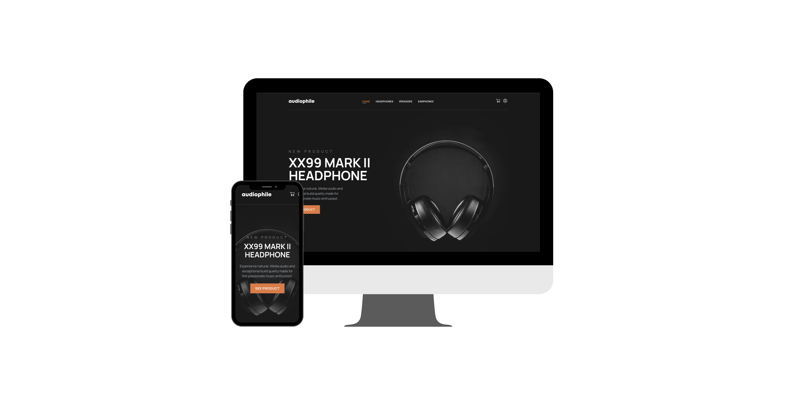

# Audiophile e-commerce client-side

## Project Overview

Audiophile E-commerce is a frontend application allowing users to browse, register, login, and manage product listings (create, read, update, delete). This repository contains the client-side (frontend) part of the application, built with React and interacting with a backend API for a seamless shopping experience. I created this project to simulate a real-world application and demonstrate my full-stack development skills. This project is primarily aimed at recruiters to showcase my abilities and help me land a job.

You can find the server-side (backend) repository [here](https://github.com/karimAoulallay/audiophile-ecommerce-api).

You can find live application [here](https://audiophile-ecommerce-vk94.onrender.com).

## Screenshots



## Tech stack

**Frontend:**

- React
- React Router
- Context API
- Fetch API
- TailwindCSS
- Vite

**Backend:**

- Express
- MongoDB
- Mongoose
- JSON Web Tokens for authentication

## Features

- User authentication and authorization
- Cart management
- Checkout process
- Auto login using refresh tokens for seamless user experience
- Using http-only cookies for authentication for safety against CSRF attacks

## Getting started

### Prerequisits

- Node.js
- Npm
- Git

### Installation

1. Clone the repository

```sh
git clone git@github.com:karimAoulallay/audiophile-ecommerce.git
```

2. Navigate to the cloned repository

```sh
cd audiophile-ecommerce
```

3. Install dependencies

```sh
npm install
```

4. Create a .env file, and add the following VITE_BASE_API_URL with your server URL :

```sh
VITE_BASE_API_URL=http://localhost:3000
```

5. Start the server

```sh
npm run dev
```

6. **Important**: You must also clone and set up the server-side repository. Follow the instructions in the [server-side repository](https://github.com/karimAoulallay/audiophile-ecommerce-api) to get it up and running.

## License

This project is licensed under the MIT License - see the [LICENSE](./LICENSE) file for details.
